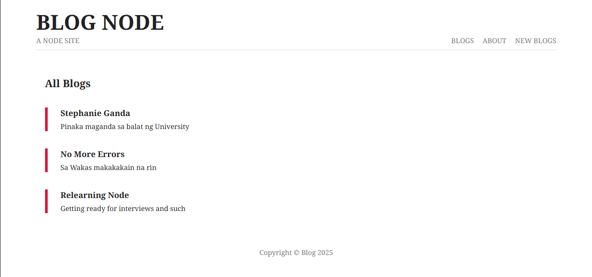
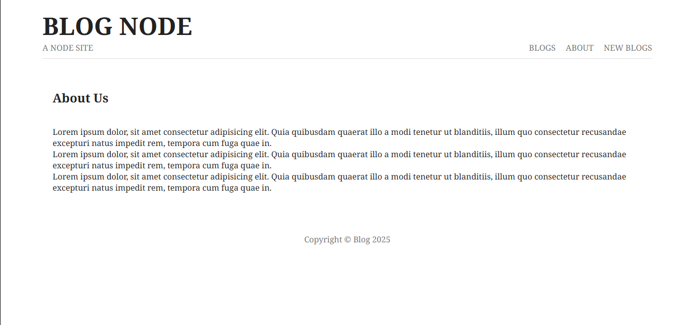
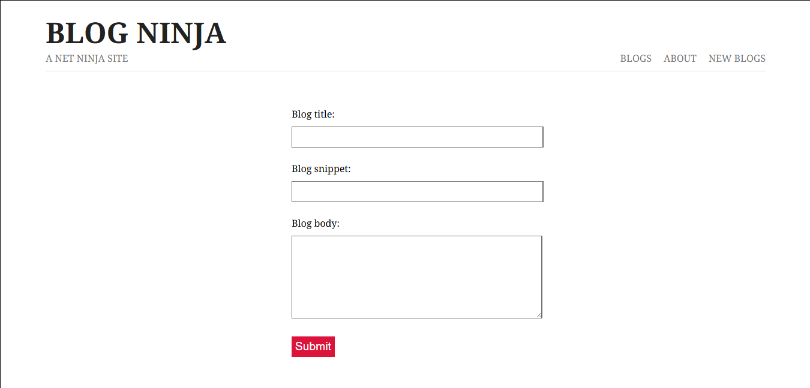

# Blog Node 


A simple blog website built with Node.js documenting my learning journey.

## Features
- Blog post creation/display
- MVC architecture
- EJS templating
- MongoDB integration
- RESTful routes

## Screenshots
| Homepage | Blog Post | About Page | Create Post |
|----------|-----------|------------|-------------|
|  |  |  |  |

## Tech Stack
- **Backend**: Node.js, Express
- **Database**: MongoDB
- **Frontend**: EJS, HTML/CSS

## What I Learned
- Node.js core concepts
- Express framework
- Database integration
- Templating with EJS
- Full CRUD operations

## Configuration
Create `.env` file:
```
MONGODB_URI=your_mongodb_connection_string
PORT=3000
```

## Installation
```bash
git clone https://github.com/your-username/blog-node.git
cd blog-node
npm install
npm start
```

## Project Structure
```
blog-node/
├── models/         # Database models
├── views/          # EJS templates
├── routes/         # Express routes
├── public/         # Static files
├── controllers/    # Business logic
├── app.js          # Main application file
└── README.md       # This file
```

## Development Notes
- Implemented authentication middleware
- Added error handling pages
- Optimized database queries
- Improved form validation

## License
MIT License - See [LICENSE](LICENSE) for details
